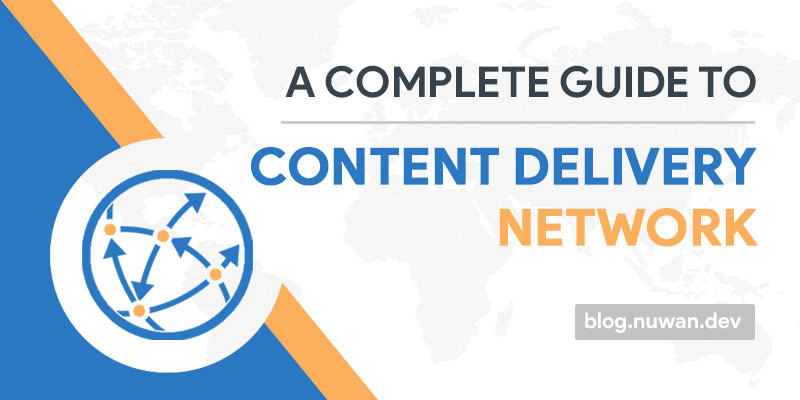

## A Complete Guide to CDN

**CDN** aka **Content Delivery Network** is one of the best use cases of distributed system. So before understand the CDN we should have a clear idea about this distributed systems. 🤓

> A distributed system, also known as distributed computing, is a system with multiple components located on different machines that communicate and coordinate actions in order to appear as a single coherent system to the end-user. - [StackPath](https://blog.stackpath.com/distributed-system/)

In simple English this means the **a group of computers** (or any computing devices) **working together** and **appear as a single entity to the end-user**. These computers doesn't have to be in same room, building or even continent. As long as they can communicate each other using messages and transfer information from one computer to another over a network it's a distributed System. Distributed systems also have three primary characteristics: all components run simultaneously, there is no global clock, and all components fail independently.

In summary distributed System :

- The each computers works toward a common goal.
- End-user of the systems views the results as single unit.
- The components connected over a network to share message to synchronize with each other.

### Use Cases

Distributed systems architecture is used in concepts like Blockchain, Content Delivery Network, Domain Name Service, Torrent and also applications like Hadoop, Redis Clustering, Google Search Engine.

---

Let's look into how CDN uses this distributed system concept in action. 🤔

## Content Delivery Network

Over the years internet has growth it's demand as a result of increasing user population. So the content of the internet got more demand and traditional client-server system failed as the transferring data between client and server getting slower and slower. There are 2 problems here.

1. When lot of users try to access the same server, same time the server getting slower to respond to the requests.
2. More far the user is from the server will affect the response receiving time.

The simple solution for this problem is replicating content in every part of the world and maintain them to provide easy and fast access for the end users. However with the cost of maintaining servers and network them across the internet is not a financial viable for most of the business.

CDN service companies simply overcome this problem by locating dedicated CDN servers in the strategically selected geographical locations. These servers will getting synchronized with the original server continuously and cache the data (usually static content) requested by users. Then the CDN servers respond requests fast by serving those cached data to user. Since user can communicate with CDN servers near to them this become more faster. Also number of requests received by one server is reduced.

According to [BuiltWith](https://trends.builtwith.com/CDN/Content-Delivery-Network), out of the top 10k websites in the world, 82.95% are using a CDN services to their content.

Let's see what are the features that CDN makes promising technology.

### ⚠️ Fault-Tolerant

In distributed systems each component work independently, so that even one component failed others are working fine. Let's see how this concept practically applied in CDN services.

In CDN data centers there are server pools and they are exposed via [Load Balancer](<https://en.wikipedia.org/wiki/Load_balancing_(computing)>) to the end users. When one of the servers failed to respond the Load Balancer automatically redirected it's traffic to the other available servers in the pool.

### 🕐 Highly Available

The data centered of CDN network is located in strategically selected locations to provide high availability. These locations are the hot-spots where huge user traffics occurred. Also the server pools and load balancing technologies used for provide reliable service.

### ♻️ Recoverable

In case of a server failure after the traffic transferred the failed server will be diagnosed and restarted automatically. Some CDN services backup the server state.

### 📌 Consistency

A CDN system have a map like routing paths and when user requests it can find the optimized path to reach the closest server and in case of failure of the whole server pool in data server it will be routed to secondly closest data center.

### 🛠 Scalability

In most CDN services scalability is happen automatically by analyzing user requests and scale up or down accordingly. In some cloud CDN you can configure this to manage cost effective business solution.

### 🔮 Predictable Performance

Automatically offloading requests to a standby components that have available capacity CDN prevent disruption of service to end-users. Fault-tolerant, scalable, consistent CDN always give the predictable results to it's end users.

### 🔐 Security

To protect the data while transferring CDN networks use **Transport Layer Security** (TLS)/**Secure Sockets Layer** (SSL) as basic steps. Basically that means content are served using "https://" URLs rather than "http://" URLs. For DDoS attacks CDN uses special software based solutions to analyze the data traffics and mitigate the attack.

## Google Cloud CDN

Google Cloud Platform (GCP) offers it's own CDN service to their customers, using their vastly distributed infrastructures.

It can be easily configured to your current cloud application with few steps via GCP console (or command line tool) and BOOM! your application get faster. Diagram below shows the architecture of one possible scenario to use Google Cloud CDN.

GCP also provides logs to find out when content was cached and when the cache was accessed.

### Other CDN Providers

- **Cloudflare** provide the most powerful CDN service with more than 180 data centers around the world. Additionally it defends your application from Distributed Denial of Service aka DDoS attacks and malicious content.
- **StackPath** (previously MaxCDN) is a CDN service for WordPress websites.
- **cdnjs & jsDeliver** are specific CDN networks for serving JavaScript and CSS libraries.
- **Google Fonts** also a kind of CDN that specifically serve fonts for websites.
- Amazon Web Services (AWS) offers the **CloudFront** as their cloud applications and also other use cases.
- Microsoft provides **Azure CDN** services to the their cloud platform customers.

## Conclusion

Content Delivery Networks are a one of the mostly used scenarios of a distributed systems. It is helping all the users to share the content globally in a cost effective way and easily manageable way. As discussed CDN services are fault-tolerant, highly available, recoverable, consistent, scalable, predictable performance, secure characteristics make it a more promising technology. 😎

In the next article I will share a practical guide to use Google Cloud CDN to speed up your web application. Until then stay safe!
